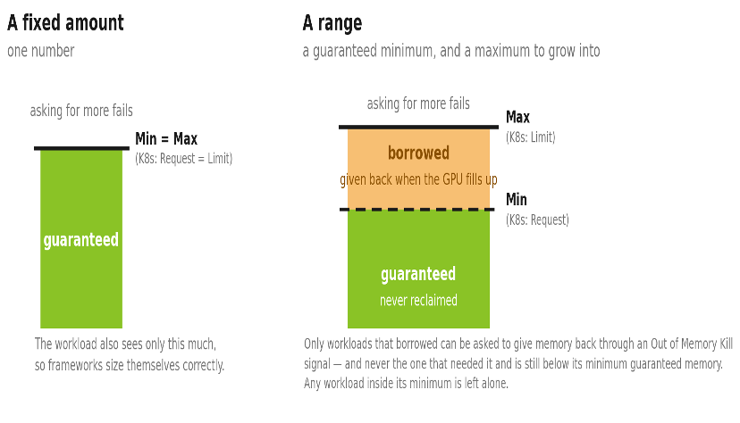
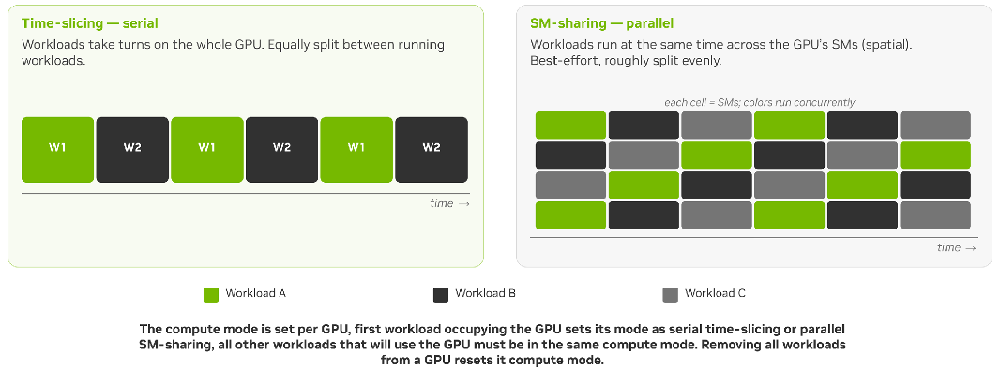

# NvFractions GPU Sharing

NvFractions is one of KAI Scheduler's operator-backed GPU-sharing mode. It uses CUDA
memory limits to enforce a GPU-memory boundary for each fractional workload.
The `gpu-sharing` operator configures the runtime support for those limits and
reports when GPU nodes are ready to accept NvFractions workloads. KAI uses the
workload's GPU-memory request to make placement and accounting decisions.

Unlike non-enforced GPU sharing, NvFractions applies CUDA memory limits at
runtime:

| Mode | Memory isolation | Request model |
| --- | --- | --- |
| `NonMemoryEnforced` | KAI schedules a fraction but does not enforce memory limits at the container level. | Pod-level `gpu-fraction` or `gpu-memory` annotations. |
| `NvFractions` | CUDA memory limits are applied through the GPU-sharing operator's runtime integration. | Per-container `request` and `limit` annotations using Kubernetes memory quantities. |

NvFractions also adds these capabilities:

- A request identifies the container that receives the fractional GPU and is
  the value KAI schedules.
- A limit can let a workload use spare memory above its request, while
  preserving the request as its guaranteed allocation.
- KAI only schedules a fractional workload after the GPU-sharing operator and
  its target GPU node report ready.

For installation, runtime configuration, and the complete annotation
reference, see [GPU Sharing](../README.md).

## Before you begin

An administrator must install KAI in `NvFractions` mode and make the
GPU-sharing operator ready before submitting workloads. In particular, the
`GpuSharingConfig` named `default` and the target GPU node must report ready.
See [NvFractions readiness](../README.md#nvfractions-readiness).

## Submit an NvFractions workload

Use the NvFractions submission instructions in the parent
[GPU Sharing guide](../README.md#request-gpu-memory-with-nvfractions). It
includes the required KAI queue label, scheduler name, and annotation format.

Ready-to-apply examples are available in the parent directory:

- [Memory request](../nv-fractions-memory.yaml)
- [Memory request and limit](../nv-fractions-request-limit.yaml)


### Dynamic fraction - Allow a workload to grow when memory is available

nvFraction`request` and `limit` operate in a similar way to the standard k8s request and limit.
Set a lower `request` and a higher `limit` when a workload has a known baseline
but can make useful progress with spare GPU memory. The request is its
guaranteed scheduling allocation; it may use memory up to its limit while that
capacity is available. The runtime can reclaim memory above the request when
the GPU becomes contended. The request must not exceed the limit. See the
[request-and-limit example](../nv-fractions-request-limit.yaml).



If only `limit` is set, KAI uses the limit as the request. Use an explicit
request when the workload should be scheduled on a guaranteed amount smaller
than its maximum.

Setting a `limit` is useful for pods that have occasional "bursts" of gpu memory usage.

## Choose a compute-sharing mode

GPU memory and GPU compute mode are selected independently. The
`kai.scheduler/gpu-compute-sharing-mode` annotation chooses how workloads in
the same fractional GPU group share compute. KAI supports these values:

| Mode | How workloads run | Best fit |
| --- | --- | --- |
| `time-slicing` | Workloads take turns using the GPU. Unused time is available to other workloads. This is the default. | Bursty development, notebooks, and throughput-oriented or latency-tolerant inference. |
| `sm-sharing` | Workloads run concurrently and share the GPU streaming multiprocessors (SMs). | Steady or latency-sensitive inference, and coordinated multi-GPU or multi-Pod workloads. Requires MPS. |

Set `kai.scheduler/gpu-compute-sharing-mode` in the NvFractions Pod manifest.
The [GPU Sharing guide](../README.md#compute-sharing-mode-within-a-fractional-gpu-group)
shows the annotation in context.



Two pods requiring diffrent gpu compute mode cannot share the same device.
Because of this, KAI keeps workloads that use different compute-sharing modes
in separatefractional GPU groups. A pod that requests `sm-sharing` is therefore not
placed with a `time-slicing` pod, and the reverse is also true.

### Choosing the right compute mode

Choose `time-slicing` for workloads that can tolerate an occasional delay and
do not use the GPU continuously. It has no MPS dependency and is the safest
default for interactive development and batch work.

Choose `sm-sharing` when concurrent GPU progress matters more than burst
throughput. For example, it can provide steadier latency for online inference
and avoids one participant pausing while other participants in a distributed
job continue to wait. Configure MPS on the GPU nodes before using this mode;
see [GPU Sharing with MPS](../mps/README.md).

## Verify the allocation

After creating the Pod, confirm that KAI scheduled it and that the runtime
started it:

```bash
kubectl get pod <pod-name> -n <namespace> -o wide
kubectl describe pod <pod-name> -n <namespace>
```

If the Pod remains pending, check the GPU-sharing configuration and the target
node's `gpu-sharing.nvidia.com/Ready` condition as described in
[Troubleshooting](../README.md#fractional-gpu-pod-stays-pending-in-nvfractions-mode).
